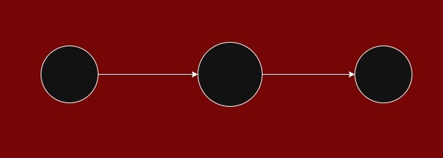
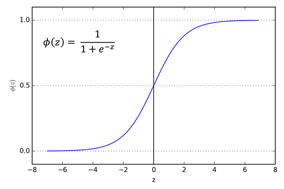

# Manual Implementation of a Simple Neural Network (1-1-1 Architecture)

This project is a step-by-step manual implementation of a minimal neural network. The objective is to explore the mathematical foundations of Deep Learning without relying on high-level frameworks (such as PyTorch or TensorFlow) to gain a deep understanding of how data flows through a network and how weights are updated during training.

## 🎯 Project Goals
1. **Understand Forward Propagation**: Implement the flow of data from the input layer to the final output.
2. **Master Backpropagation**: Perform step-by-step gradient calculations using the **Chain Rule**.
3. **Implement Activation Functions**: Apply **ReLU** for the hidden layer and **Sigmoid** for the output layer.
4. **Optimization**: Understand how the **Loss Function** drives weight updates via **Gradient Descent**.

## 🏗 Network Architecture
The network uses the simplest possible structure to demonstrate all core neural network principles:

- **Input Layer**: 1 neuron (a single feature $x$).
- **Hidden Layer**: 1 neuron with **ReLU** activation.
- **Output Layer**: 1 neuron with **Sigmoid** activation.
- **Task**: Binary Classification (predicting 0 or 1).

  

### Sigmoid Activation Function

Before diving into the forward pass, it is important to understand the role of activation functions in neural networks.

  

The Sigmoid function is a nonlinear activation function that maps input values into the range $(0, 1)$:

\$$
\sigma(x) = \frac{1}{1 + e^{-x}}
\$$

It is commonly used in binary classification tasks because its output can be interpreted as a probability.

Activation functions introduce non-linearity into the model.  
Without them, a neural network would behave like a simple linear model, regardless of the number of layers.

This means the model would not be able to learn complex patterns in the data.

### ReLU (Rectified Linear Unit)

### Data Flow Diagram:
`Input (x) ➔ [Weight 1, Bias 1] ➔ ReLU ➔ [Weight 2, Bias 2] ➔ Sigmoid ➔ Output (ŷ)`

## 🧮 Step-by-Step Manual Calculations

### 1. Forward Pass
Given a single input observation $x$ (scalar), we compute the output $\hat{y}$ as follows:

**Hidden Layer:**
- Linear combination: $z_1 = w_1 \cdot x + b_1$
- Activation (ReLU): $a_1 = \max(0, z_1)$

**Output Layer:**
- Linear combination: $z_2 = w_2 \cdot a_1 + b_2$
- Activation (Sigmoid): $\hat{y} = \sigma(z_2) = \frac{1}{1 + e^{-z_2}}$

**Loss Function (Binary Cross-Entropy):**
$$L = -\left[ y \log(\hat{y}) + (1 - y) \log(1 - \hat{y}) \right]$$

---

### 2. Backward Pass (Backpropagation)
To update the weights, we need to find the gradient of the loss $L$ with respect to each parameter using the **Chain Rule**.

#### A. Output Layer Gradients
The goal is to find $\frac{\partial L}{\partial w_2}$ and $\frac{\partial L}{\partial b_2}$.

By the chain rule:
$$\frac{\partial L}{\partial w_2} = \frac{\partial L}{\partial \hat{y}} \cdot \frac{\partial \hat{y}}{\partial z_2} \cdot \frac{\partial z_2}{\partial w_2}$$

1. **Loss derivative**: $\frac{\partial L}{\partial \hat{y}} = -\frac{y}{\hat{y}} + \frac{1 - y}{1 - \hat{y}}$
2. **Sigmoid derivative**: $\frac{\partial \hat{y}}{\partial z_2} = \hat{y}(1 - \hat{y})$
3. **Weight derivative**: $\frac{\partial z_2}{\partial w_2} = a_1$

**Pro Tip (The Simplification):**
When we multiply the loss derivative by the sigmoid derivative, the expression simplifies elegantly:
$$\frac{\partial L}{\partial z_2} = \left( -\frac{y}{\hat{y}} + \frac{1 - y}{1 - \hat{y}} \right) \cdot \hat{y}(1 - \hat{y}) = \hat{y} - y$$

Thus, the final gradients for the output layer are:
$$\frac{\partial L}{\partial w_2} = (\hat{y} - y) \cdot a_1$$
$$\frac{\partial L}{\partial b_2} = (\hat{y} - y) \cdot 1$$

#### B. Hidden Layer Gradients
Now we propagate the error further back to find $\frac{\partial L}{\partial w_1}$ and $\frac{\partial L}{\partial b_1}$.

$$\frac{\partial L}{\partial w_1} = \frac{\partial L}{\partial z_2} \cdot \frac{\partial z_2}{\partial a_1} \cdot \frac{\partial a_1}{\partial z_1} \cdot \frac{\partial z_1}{\partial w_1}$$

1. **From previous step**: $\frac{\partial L}{\partial z_2} = (\hat{y} - y)$
2. **Linear output derivative**: $\frac{\partial z_2}{\partial a_1} = w_2$
3. **ReLU derivative**: $\frac{\partial a_1}{\partial z_1} = \begin{cases} 1 & \text{if } z_1 > 0 \\ 0 & \text{if } z_1 \le 0 \end{cases}$
4. **Input derivative**: $\frac{\partial z_1}{\partial w_1} = x$

Final gradients for the hidden layer:
$$\frac{\partial L}{\partial w_1} = (\hat{y} - y) \cdot w_2 \cdot \text{ReLU}'(z_1) \cdot x$$
$$\frac{\partial L}{\partial b_1} = (\hat{y} - y) \cdot w_2 \cdot \text{ReLU}'(z_1)$$

$\frac{\partial L}{\partial z} = \hat{y} - y$</b>

To understand why the gradient simplifies so elegantly, let's derive it step-by-step.

**1. Derivative of Loss w.r.t Output ($\hat{y}$):**
Given $L = -[y \log(\hat{y}) + (1 - y) \log(1 - \hat{y})]$,
$$\frac{\partial L}{\partial \hat{y}} = -\frac{y}{\hat{y}} + \frac{1-y}{1-\hat{y}} = \frac{-y(1-\hat{y}) + (1-y)\hat{y}}{\hat{y}(1-\hat{y})} = \frac{\hat{y} - y}{\hat{y}(1-\hat{y})}$$

**2. Derivative of Sigmoid w.r.t Input ($z$):**
Given $\hat{y} = \sigma(z)$, the derivative is:
$$\frac{\partial \hat{y}}{\partial z} = \sigma(z)(1 - \sigma(z)) = \hat{y}(1 - \hat{y})$$

**3. Applying the Chain Rule:**
$$\frac{\partial L}{\partial z} = \frac{\partial L}{\partial \hat{y}} \cdot \frac{\partial \hat{y}}{\partial z}$$
$$\frac{\partial L}{\partial z} = \frac{\hat{y} - y}{\hat{y}(1-\hat{y})} \cdot \hat{y}(1 - \hat{y})$$

Canceling the terms $\hat{y}(1 - \hat{y})$, we get:
$$\frac{\partial L}{\partial z} = \hat{y} - y$$

This result is intuitive: the gradient is simply the **difference between the prediction and the actual target**.

---

### 3. Weight Update
Finally, we update the weights using Gradient Descent with a learning rate $\eta$:
$$w_{new} = w_{old} - \eta \cdot \frac{\partial L}{\partial w}$$
$$b_{new} = b_{old} - \eta \cdot \frac{\partial L}{\partial b}$$

## 📋 Computational Workflow
The learning process is broken down into the following stages:

1. **Initialization**: Defining initial weights ($w$) and biases ($b$).
2. **Forward Pass**:
   - Computing the weighted sum and applying ReLU in the hidden layer.
   - Computing the final value and applying the Sigmoid function at the output.
3. **Loss Calculation**: Using **Binary Cross-Entropy** to evaluate the prediction error.
4. **Backward Pass (Backpropagation)**:
   - Calculating the partial derivatives of the loss function with respect to each weight and bias.
   - Propagating the error from the output back to the input.
5. **Weight Update**: Adjusting the parameters using a specified **learning rate ($\eta$)**.

---

<!-- This is where you will insert your manual calculations later -->
## 🧮 Step-by-Step Manual Calculations
(Detailed formulas and numerical calculations will be added here...)
