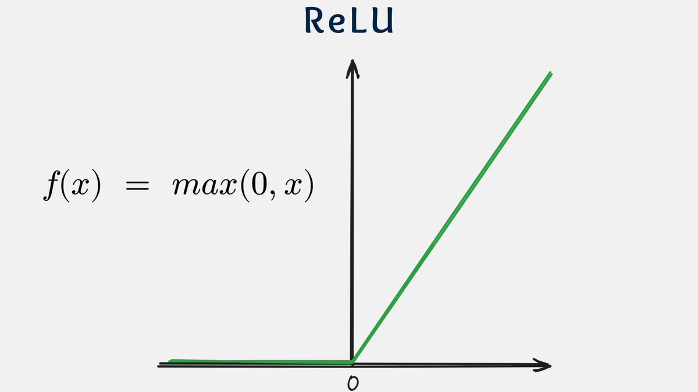
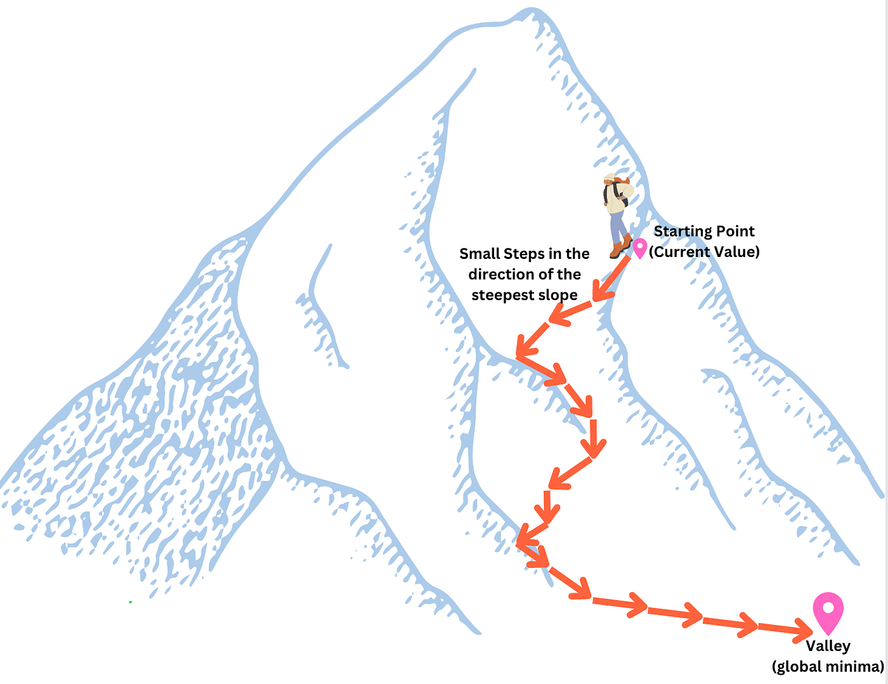

# Manual Implementation of a Simple Neural Network (1-1-1 Architecture)

This project is a deep dive into the internal mechanics of neural networks. Unlike typical projects that start with coding, the primary focus here is the **manual mathematical derivation** of the entire learning process. 

The core idea is to perform every single calculation—from the forward pass to the gradient updates—**manually (on paper/mathematically)** without relying on any software, and then use a framework like PyTorch solely to verify if the manual results are correct.

## Project Goals

The main objective is to move away from the "black box" approach of deep learning and master the logic from first principles.

1. **Manual Calculation (Zero Code)**: To perform the forward propagation and backpropagation steps manually using a scalar input, calculating every intermediate value and gradient by hand.
2. **Mathematical Derivation**: To apply the **Chain Rule** manually to derive the exact partial derivatives for each weight ($w_1, w_2$) and bias ($b_1, b_2$) in the network.
3. **Understanding "Under the Hood"**: To visualize exactly how an error at the output layer "flows" back through the ReLU activation and weights to reach the first layer.
4. **Gradient Descent**: To manually implement the optimization process, understanding how the learning rate ($\eta$) and the negative gradient are used to update parameters and iteratively minimize the loss function.

```python
import torch
import torch.nn as nn
import torch.optim as optim

# 1. Data Setup
X = torch.tensor([[1.0]], requires_grad=True) 
Y = torch.tensor([[0.0]])

# 2. Structure: Linear(1,1) -> ReLU -> Linear(1,1) -> Sigmoid
model = nn.Sequential(
    nn.Linear(1, 1),
    nn.ReLU(),
    nn.Linear(1, 1),
    nn.Sigmoid()
)

# 3. Loss and Optimizer
criterion = nn.BCELoss() # Binary Cross Entropy Loss
optimizer = optim.SGD(model.parameters(), lr=0.1) # Stochastic Gradient Descent

# 4. Training Loop
epochs = 100
print(f"Starting training for {epochs} epochs...\n")

for epoch in range(epochs):
    # a. Reset gradients from the previous step to prevent accumulation
    optimizer.zero_grad()
    
    # b. Forward Pass: Compute prediction (ŷ)
    y_hat = model(X)
    
    # c. Compute Loss (L)
    loss = criterion(y_hat, Y)
    
    # d. Backward Pass: Autograd computes gradients using the Chain Rule
    loss.backward()
    
    # e. Optimization: Update weights using the formula: w = w - lr * grad
    optimizer.step()
```

### Network Architecture
The network uses the simplest possible structure to demonstrate all core neural network principles:

- **Input Layer**: 1 neuron (a single feature $x$).
- **Hidden Layer**: 1 neuron with **ReLU** activation.
- **Output Layer**: 1 neuron with **Sigmoid** activation.
- **Task**: Binary Classification (predicting 0 or 1).

<p align="center">
  
</p>

---

### Sigmoid Activation Function

Before diving into the forward pass, it is important to understand the role of activation functions in neural networks.

<p align="center">
  
</p>

The Sigmoid function is a nonlinear activation function that maps input values into the range $(0, 1)$:

\$$
\sigma(z) = \frac{1}{1 + e^{-z}}
\$$

It is commonly used in binary classification tasks because its output can be interpreted as a probability.

---

### ReLU (Rectified Linear Unit)

<p align="center">
  
</p>

The ReLU (Rectified Linear Unit) activation function is defined as:

$$
f(x) = \max(0, x)
$$

$$
f(x) =
\begin{cases}
x, & x > 0 \\
0, & x \leq 0
\end{cases}
$$

It performs a simple thresholding operation:
- passes positive values unchanged
- sets all negative values to zero

ReLU enables sparse activation and maintains strong gradient flow for positive inputs, which improves training efficiency in deep neural networks.

Activation functions introduce non-linearity into the model.  
Without them, a neural network would behave like a simple linear model, regardless of the number of layers.
This means the model would not be able to learn complex patterns in the data.

### BCELoss (Binary Cross Entropy)

$$
\mathcal{L} = - \left( y \log(p) + (1 - y)\log(1 - p) \right)
$$

Measures the error between predicted probability \(p\) and binary target \(y\). Strongly penalizes confident misclassifications and is commonly used with sigmoid outputs.

---

## Step-by-Step Manual Calculations

### 1. Forward Pass
Given a single input observation $x$ (scalar), we compute the output $\hat{y}$ as follows:

**Hidden Layer:**
- Linear combination:
  
  $$z_1 = w_1 \cdot x + b_1$$
  
- Activation (ReLU):
  
  $$h_1 = \max(0, z_1)$$

**Output Layer:**
- Linear combination:
  $$z_2 = w_2 \cdot h_1 + b_2$$
- Activation (Sigmoid):
  $$\hat{y} = \sigma(z_2) = \frac{1}{1 + e^{-z_2}}$$

**Loss Function (Binary Cross-Entropy):**
- $$L = -\left[ y \log(\hat{y}) + (1 - y) \log(1 - \hat{y}) \right]$$

---

### 2. Backward Pass (Backpropagation)

Our goal is to find the gradients of the loss function $L$ with respect to each of our trainable parameters. These gradients tell us how much we need to change the weights to decrease the error:

$$\frac{\partial L}{\partial \mathbf{w_1}}, \quad \frac{\partial L}{\partial \mathbf{b_1}}, \quad \frac{\partial L}{\partial \mathbf{w_2}}, \quad \frac{\partial L}{\partial \mathbf{b_2}}$$

By applying the [chain rule](https://www.youtube.com/watch?v=YG15m2VwSjA&t=108s), we compute the gradients of the loss function with respect to the second-layer parameters $\( \frac{\partial \mathcal{L}}{\partial w_2} \)$ and $\( \frac{\partial \mathcal{L}}{\partial b_2} \)$ as follows:

$$
\frac{\partial \mathcal{L}}{\partial w_2}
\=
\frac{\partial \mathcal{L}}{\partial \hat{y}}
\cdot
\frac{\partial \hat{y}}{\partial z_2}
\cdot
\frac{\partial z_2}{\partial w_2}
$$

$$
\frac{\partial \mathcal{L}}{\partial b_2}
\=
\frac{\partial \mathcal{L}}{\partial \hat{y}}
\cdot
\frac{\partial \hat{y}}{\partial z_2}
\cdot
\frac{\partial z_2}{\partial b_2}
$$

To compute the updates for the output layer, we derive the partial derivatives step-by-step.

#### 1. Gradient of the Loss with respect to the Prediction ($\hat{y}$)
We start with the Binary Cross-Entropy loss:
$$L = -\left[ y \log(\hat{y}) + (1 - y) \log(1 - \hat{y}) \right]$$

Based on the standard [derivative](https://www.math.wustl.edu/~freiwald/131derivativetable.pdf) rule $\frac{d}{dx} \log(x) = \frac{1}{x}$:

$$\frac{\partial L}{\partial \hat{y}} = -\left( y \frac{d(\log \hat{y})}{d\hat{y}} + (1 - y) \frac{d(\log(1 - \hat{y}))}{d\hat{y}} \right) \implies \frac{\partial L}{\partial \hat{y}} = -\left( \frac{y}{\hat{y}} + (1 - y) \frac{1}{1 - \hat{y}} \cdot (-1) \right)$$
$$\implies \frac{\partial L}{\partial \hat{y}} = -\frac{y}{\hat{y}} + \frac{1 - y}{1 - \hat{y}} \implies \frac{\partial L}{\partial \hat{y}} = \frac{-y(1 - \hat{y}) + \hat{y}(1 - y)}{\hat{y}(1 - \hat{y})} \implies \frac{\partial L}{\partial \hat{y}} = \frac{-y + y\hat{y} + \hat{y} - y\hat{y}}{\hat{y}(1 - \hat{y})} \implies \frac{\partial L}{\partial \hat{y}} = \frac{\hat{y} - y}{\hat{y}(1 - \hat{y})}$$

#### 2. Gradient of the Activation with respect to the Logit ($z_2$)

$$\frac{\partial \hat{y}}{\partial z_2} = \frac{d}{dz_2} (1 + e^{-z_2})^{-1} = \frac{e^{-z_2}}{(1 + e^{-z_2})^2} = \frac{1}{1 + e^{-z_2}} \cdot \frac{e^{-z_2}}{1 + e^{-z_2}} = \hat{y}(1 - \hat{y})$$

We substitute the complex fractions with $\hat{y}$ based on the definition of the sigmoid function:
1. By definition: $\hat{y} = \frac{1}{1 + e^{-z_2}}$
2. Consequently: $1 - \hat{y} = 1 - \frac{1}{1 + e^{-z_2}} = \frac{1 + e^{-z_2} - 1}{1 + e^{-z_2}} = \frac{e^{-z_2}}{1 + e^{-z_2}}$

Thus, the derivative simplifies perfectly to $\hat{y}(1 - \hat{y})$.

#### 3. Gradient of the Linear Combination with respect to Weights and Bias
The input to the sigmoid is $z_2 = h_1 w_2 + b_2$.

$$\frac{\partial z_2}{\partial w_2} = \frac{\partial (h_1 w_2 + b_2)}{\partial w_2} = h_1$$
$$\frac{\partial z_2}{\partial b_2} = \frac{\partial (h_1 w_2 + b_2)}{\partial b_2} = 1$$

Now, by combining the previously derived differentials using the **Chain Rule**, we can find the final gradients for the weights and biases of the output layer.

#### Calculating $\frac{\partial L}{\partial w_2}$:

$$\begin{aligned}
\frac{\partial L}{\partial w_2} &= \frac{\partial L}{\partial \hat{y}} \cdot \frac{\partial \hat{y}}{\partial z_2} \cdot \frac{\partial z_2}{\partial w_2} &= \underbrace{\frac{\hat{y} - y}{\hat{y}(1 - \hat{y})}}_{\text{Loss derivative}} \cdot \underbrace{\hat{y}(1 - \hat{y})}_{\text{Sigmoid derivative}} \cdot \underbrace{h_1}_{\text{Input to layer}} &= (\hat{y} - y) \cdot h_1
\end{aligned}$$

#### Calculating $\frac{\partial L}{\partial b_2}$:

$$\begin{aligned}
\frac{\partial L}{\partial b_2} &= \frac{\partial L}{\partial \hat{y}} \cdot \frac{\partial \hat{y}}{\partial z_2} \cdot \frac{\partial z_2}{\partial b_2} &= \frac{\hat{y} - y}{\hat{y}(1 - \hat{y})} \cdot \hat{y}(1 - \hat{y}) \cdot 1 &= \hat{y} - y
\end{aligned}$$

---

### Intuitive Interpretation

The resulting formulas $\frac{\partial L}{\partial w_2} = (\hat{y} - y)h_1$ and $\frac{\partial L}{\partial b_2} = (\hat{y} - y)$ are remarkably simple and reveal the core logic of neural network learning:

1. **The Error Signal $(\hat{y} - y)$**: 
   The term $(\hat{y} - y)$ represents the **prediction error**. 
   - If the prediction $\hat{y}$ is very close to the target $y$, the error is near $0$, and the weights barely change.
   - If the error is large (e.g., $\hat{y}=0.1$ but $y=1$), the gradient becomes large, forcing the network to make a significant adjustment.

2. **The Influence of the Input ($h_1$)**:
   The gradient for the weight $w_2$ is scaled by $h_1$. This means:
   - If the hidden neuron $h_1$ was **inactive** (output 0), it didn't contribute to the error, so its weight $w_2$ is not updated.
   - If $h_1$ was **strongly active**, it had a big impact on the result, so it receives a larger share of the "blame" for the error and is updated more.

3. **The Bias Adjustment**:
   The bias $b_2$ is updated based solely on the error $(\hat{y} - y)$. It acts as a "global shifter" for the neuron, moving the activation threshold up or down regardless of the input value.
   
---

Now we propagate the error gradient back to the first layer to find how the initial weight $w_1$ and bias $b_1$ contributed to the final loss.

To calculate the gradients for the hidden layer, we follow the path from the loss $L$ back to the parameters $w_1$ and $b_1$:

$$\frac{\partial L}{\partial w_1} = \underbrace{\frac{\partial L}{\partial \hat{y}} \cdot \frac{\partial \hat{y}}{\partial z_2}}_{\text{Output Error}} \cdot \underbrace{\frac{\partial z_2}{\partial h_1}}_{\text{Layer 2 Weight}} \cdot \underbrace{\frac{\partial h_1}{\partial z_1}}_{\text{Activation}} \cdot \underbrace{\frac{\partial z_1}{\partial w_1}}_{\text{Input}}$$

$$\frac{\partial L}{\partial b_1} = \underbrace{\frac{\partial L}{\partial \hat{y}} \cdot \frac{\partial \hat{y}}{\partial z_2}}_{\text{Output Error}} \cdot \underbrace{\frac{\partial z_2}{\partial h_1}}_{\text{Layer 2 Weight}} \cdot \underbrace{\frac{\partial h_1}{\partial z_1}}_{\text{Activation}} \cdot \underbrace{\frac{\partial z_1}{\partial b_1}}_{\text{Bias Constant}}$$

We can now substitute the values we have already derived:

**Combined Output Error**: 
- From our previous step, we know that the gradient flowing into the second layer is:
$$\frac{\partial L}{\partial z_2} = \frac{\partial L}{\partial \hat{y}} \cdot \frac{\partial \hat{y}}{\partial z_2} = (\hat{y} - y)$$

**Layer 2 Influence**: 
- Given $z_2 = h_1 w_2 + b_2$, the derivative with respect to the hidden activation $h_1$ is:
$$\frac{\partial z_2}{\partial h_1} = w_2$$

**ReLU Activation**: 
- Given $h_1 = \text{ReLU}(z_1)$, the derivative is:

$$
\frac{\partial h_1}{\partial z_1} = \text{ReLU}'(z_1) = 
\begin{cases} 
1, & \text{if } z_1 > 0 \\ 
0, & \text{if } z_1 \le 0 
\end{cases}
$$

**Linear Input**: 
- Given $z_1 = x w_1 + b_1$, the derivatives are:
  
$$\frac{\partial z_1}{\partial w_1} = x \quad \text{and} \quad \frac{\partial z_1}{\partial b_1} = 1$$

By multiplying these components together, we arrive at the final gradients for the first layer:

$$\frac{\partial L}{\partial w_1} = (\hat{y} - y) \cdot w_2 \cdot \text{ReLU}'(z_1) \cdot x$$

$$\frac{\partial L}{\partial b_1} = (\hat{y} - y) \cdot w_2 \cdot \text{ReLU}'(z_1)$$

---

### Intuitive Interpretation

1. **The "Gate" Effect (ReLU)**: 
   Notice that $\text{ReLU}'(z_1)$ acts as a switch. 
   - If $z_1 \le 0$, the gradient becomes **exactly 0**. This means the neuron is "dead," and no matter how large the error $(\hat{y} - y)$ is, the weights $w_1$ and $b_1$ will **not be updated**. This is known as the **"Dying ReLU" problem**.
   - If $z_1 > 0$, the gradient flows freely.

2. **Weight Scaling**: 
   The error is scaled by $w_2$. This means the hidden layer's update depends on how much the output layer "trusted" the hidden neuron. If $w_2$ is very small, the hidden layer's contribution to the final result was minimal, so its weights are updated less.

3. **Input Dependence**: 
   Just like in the output layer, $\frac{\partial L}{\partial w_1}$ is proportional to the input $x$. Larger inputs cause larger weight updates.
   
---

## Weight Update & Learning Rate

After calculating the gradients ($\frac{\partial L}{\partial w}$ and $\frac{\partial L}{\partial b}$), we need to adjust the network's parameters to reduce the loss. This is achieved using the **Gradient Descent** algorithm.

### 1. The Update Rule
The weights and biases are updated by moving them in the **opposite direction** of the gradient. The formula for the update is:

$$w_{new} = w_{old} - \eta \cdot \frac{\partial L}{\partial w}$$
$$b_{new} = b_{old} - \eta \cdot \frac{\partial L}{\partial b}$$

Where:
- $\frac{\partial L}{\partial w}$ is the **gradient**, which tells us the slope of the loss function (the direction of the steepest increase).
- $\eta$ (eta) is the **Learning Rate**, a hyperparameter that controls the size of the step we take.

### 2. Understanding the Learning Rate ($\eta$)
The learning rate is one of the most critical hyperparameters in deep learning. It determines how "aggressively" the network learns.

#### Case 1: Learning Rate is too high ($\eta \uparrow$)
If the step size is too large, the update might "overshoot" the minimum of the loss function. Instead of converging, the loss may oscillate or even diverge (increase), making the model unstable.
*   **Result:** The model fails to converge.

#### Case 2: Learning Rate is too low ($\eta \downarrow$)
If the step size is too small, the network will take an extremely long time to reach the minimum. It may also get stuck in a **local minimum** or a **saddle point**, never reaching the best possible solution.
*   **Result:** Training is painfully slow and potentially suboptimal.

### 3. The Intuition: The Foggy Mountain Analogy

<p align="center">
  
</p>

Imagine you are standing on a foggy mountain (the Loss Surface) and your goal is to reach the valley (the minimum Loss).
- The **gradient** is like the slope of the ground under your feet; it tells you which way is "up."
- Since you want to go "down," you take a step in the **opposite direction** of the gradient.
- The **learning rate** is the **length of your stride**. 
    - If your stride is too long, you might jump over the valley and land on the other slope.
    - If your stride is too short, it will take you years to reach the bottom.


## Training Dynamics & Model Performance

To successfully train a network, we need to manage how many times the model sees the data and how well it generalizes to new information.

### Epoch
An **Epoch** is one complete pass of the entire training dataset through the neural network. 
- In one epoch, every single training example has had one opportunity to update the weights.
- Since one pass is rarely enough for the weights to converge to their optimal values, we train the model for **multiple epochs**.
- **Goal:** Find the point where the loss stops decreasing (convergence) without over-training.

### Overfitting vs. Underfitting

During training, we strive for a balance between two common pitfalls:

| Concept | What is it? | Cause | Result |
| :--- | :--- | :--- | :--- |
| **Underfitting** | The model is too simple to capture the underlying pattern of the data. | Too few epochs, learning rate too low, or architecture too simple. | High error on both training and test data. |
| **Overfitting** | The model "memorizes" the training data (including noise) instead of learning the pattern. | Too many epochs, model too complex for the amount of data. | Low error on training data, but high error on new (test) data. |

**The Sweet Spot:** The ideal model generalizes well, meaning it performs accurately on data it has never seen before.
